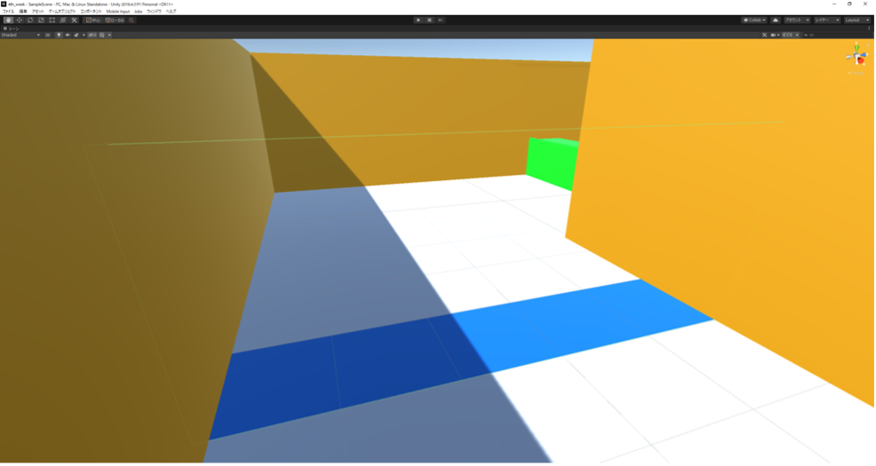
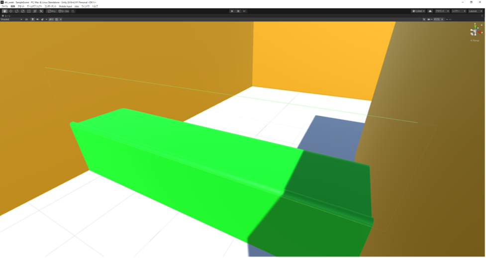
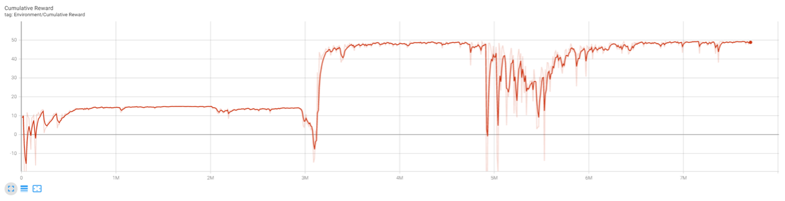
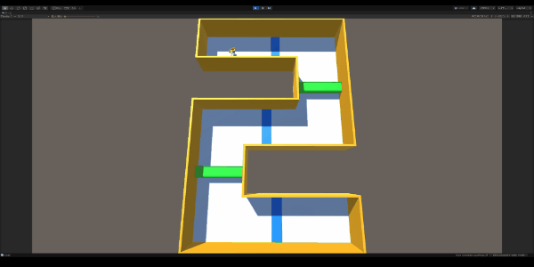

# unity-reinforcement-learning
### Unity ML-Agentsを用いて、AgentであるSDユニティちゃんを強化学習(模倣学習+カリキュラム学習)させました

### Motivation
- 慣性が働くジャンプ動作を取り入れた強化学習モデルを学習させようと考えました

### Tricks
- Agent側の複数キーの同時入力許可
- SDUnityちゃんの動作可能なアクションを８方向に制限
- コースを順方向に進んでいるか、逆方向に進んでいるかの判定
- 壁に接触したかどうかの判定
- ゴールを徐々に移動させることによる模倣+カリキュラム学習の実現

### パネルチェックポイント

### 段差チェックポイント

### 平均報酬グラフ

### 学習結果

### 環境
- python3.8
- Unity 2021.1.27
- SDユニティちゃん 1.01
- Unity ML-Agents 0.27.0
